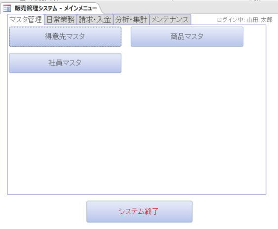
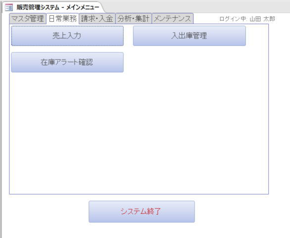
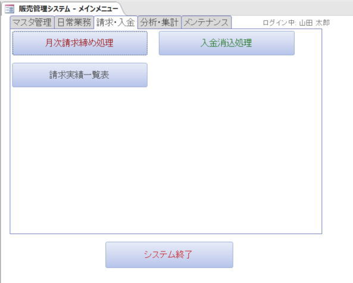
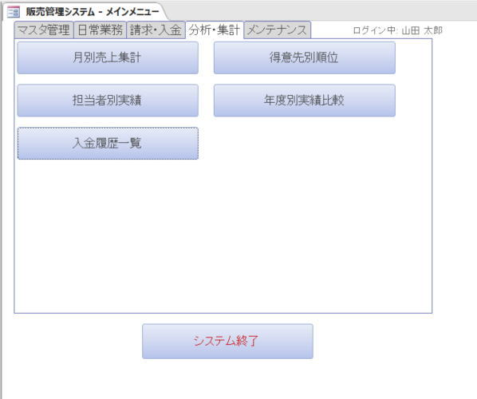
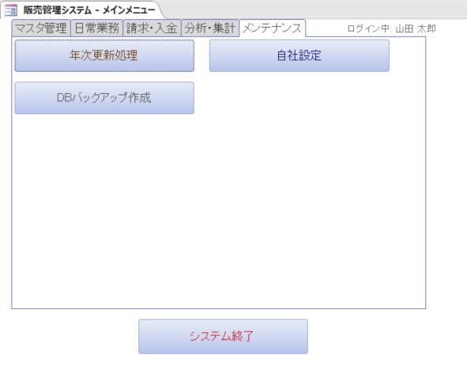

# 販売管理システム（Access VBA）

## 概要
中小企業向けの本格的な販売管理システムです。
マスタ管理から日常業務（受注・出荷）、月次請求締め、入金消込、在庫管理、そして多彩な分析レポートまで、販売業務に必要な一連のサイクルを一元管理できます。
また、フロントエンド（フォーム・クエリ等）とバックエンド（テーブル）の分離構成に対応しており、ネットワーク共有環境での複数ユーザーによる同時利用を想定した設計となっています。

## 主な機能

### 1. マスタ管理
- **得意先マスタ**: 顧客情報の登録・編集（一覧印刷対応）
- **商品マスタ**: 商品情報の管理、標準単価や廃止フラグの管理（一覧印刷対応）
- **社員マスタ**: ログインユーザーや営業担当者の管理（一覧印刷対応）
- **自社設定**: 自社の住所・連絡先、消費税率などのシステム基本設定

### 2. 日常業務（受注・売上管理 / 在庫管理）
- **売上入力**:
  - 見積・受注・出荷済・請求済などのステータス管理
  - 明細行での単価変動対応（受注時点の単価・消費税率を保持）
  - 「出荷確定」ボタンによるリアルタイムな在庫引当・出庫処理
  - 個別の請求書（納品書）発行プレビュー
- **入出庫管理**:
  - 仕入、売上、返品、棚卸調整などの区分に応じた在庫履歴の記録
- **在庫アラート確認**:
  - 発注点（安全在庫）を下回った商品を一覧表示し、発注漏れを防止

### 3. 請求・入金管理
- **月次請求締め処理**:
  - 指定した年月・締日に基づき、未請求の売上データを集計して請求書を一括作成
- **入金消込処理**:
  - 顧客からの入金情報を登録し、未入金・請求残高を管理
- **請求実績一覧**:
  - 過去の請求履歴の一覧表示と確認

### 4. 分析・集計レポート
- **月別売上集計**: 年月を指定しての売上レポート出力
- **得意先別順位**: 得意先ごとの売上高ランキング集計
- **担当者別実績**: スタッフごとの売上実績集計
- **年度別実績比較**: 年ごとの売上推移と、月別・年別の小計・総合計レポートの出力

### 5. メンテナンス・運用支援
- **ユーザー認証機能**: 起動時のログイン画面による担当者ごとの権限・履歴管理
- **年次更新処理**: 年次のデータ整理や更新作業
- **DBバックアップ作成**: ボタン一つで現在のデータベースのバックアップファイル（日付付き）を自動生成
- **フロント / バックエンド分離**: `Frontend.accdb` と `Backend.accdb` に分割し、共有フォルダでのマルチユーザー運用をサポート（楽観的排他制御実装）

## 開発・動作環境
- Microsoft Access 2021 (Microsoft 365 含む)
- Visual Basic for Applications (VBA)
- DAO (Data Access Objects)
- Windows 10 / 11

## インストール・セットアップ手順
1. 本リポジトリからすべてのファイル（`.bas` モジュール群、設定スクリプト等）をダウンロードします。
2. Accessで新規の空のデータベース（例: `Frontend.accdb`）を作成します。
3. VBAエディタ（Alt + F11）を開き、すべての `.bas` ファイルをインポートします。
4. イミディエイトウィンドウで `RunAllSetup` と入力し、Enterキーを押して実行します。
   - ※自動的にバックエンド用DBの作成やテーブル、クエリ、フォーム、レポートのビルドが行われます。
5. 作成された `F_Login` フォームからログインし（初期設定の場合はそのままログイン可）、`F_Menu` 画面が開けばセットアップ完了です。

## スクリーンショット

### メインメニュー

### 売上入力画面

### レポート画面
